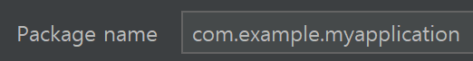
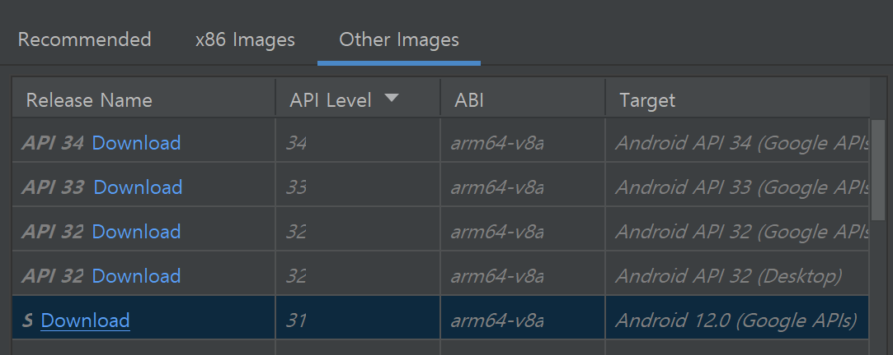

패키지 명은 3가지 키워드를 쉼표 사이에 넣을 것
- 웹사이트 주소를 거꾸로 한 것과 유사함

SDK: Software Developer Kit: 소프트웨어 개발 도구와 패키지를 모은 것

activity_main.xml: 메인 액티비티가 xml 파일을 속성으로 사용자 인터페이스로 들어있는 파일

```
setContentView(R.layout.activity_main)
```

xml파일은 res 폴더에 있음
- drawable, layout 등


### 가상환경 설정 


